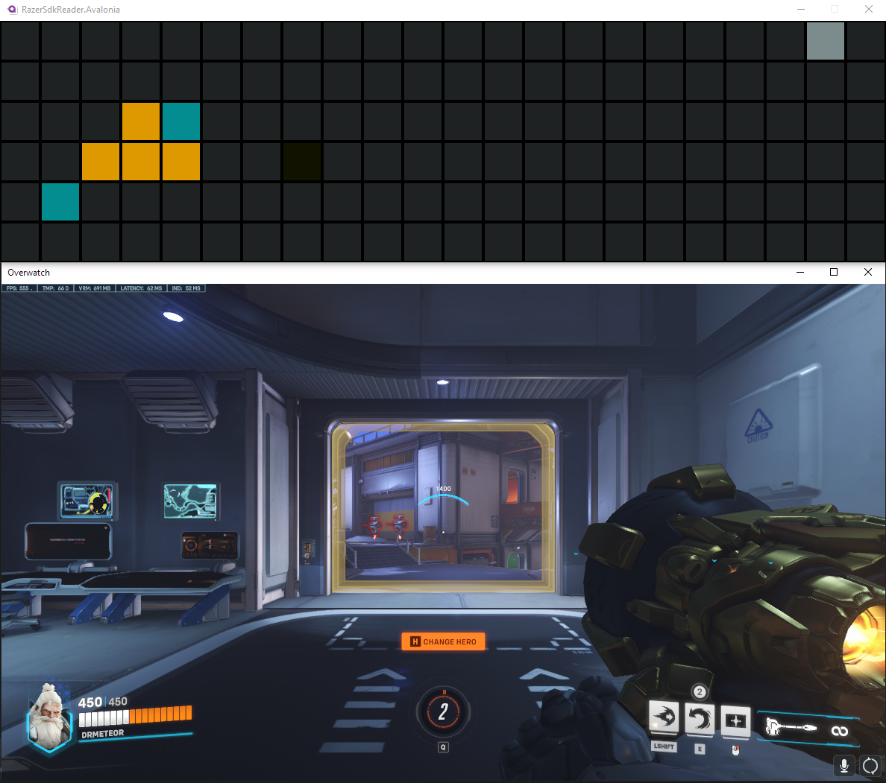
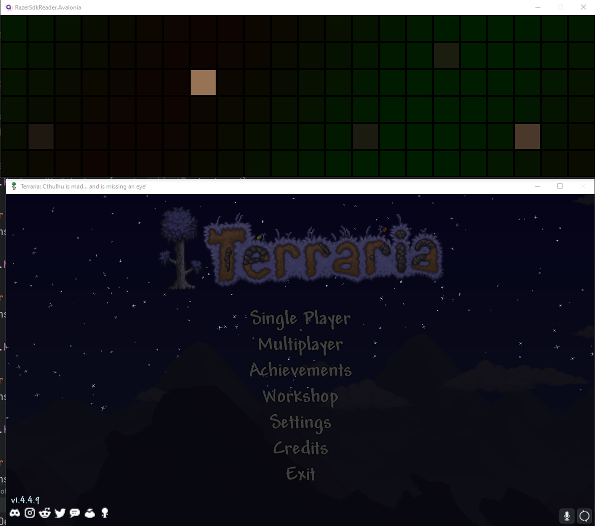

# RazerSdkReader
[](https://www.nuget.org/packages/RazerSdkReader)

RazerSdkReader is a .NET library for reading data from Razer Chroma SDK devices. It provides a simple API for accessing data from Razer Chroma keyboards, mice, mousepads, keypads, headsets, ChromaLink devices, and more, replicating the functionality provided by the Razer Chroma Emulator.

## Usage

Package is available on [Nuget](RazerSdkReader)

Consult src/RazerSdkReader.ConsoleApp/Program.cs for a full example.

```cs
using RazerSdkReader;

void RazerEmulatorReaderOnKeyboardUpdated(object? sender, in ChromaKeyboard e)
{
    for (byte y = 1; y < e.Height; y++)
    {
        for (byte x = 1; x < e.Width; x++)
        {
            var color = e.GetColor(y * e.Width + x);
            //do something with the color
        }
    }
}

// Create a new instance of the RazerSdkReader class
var reader = new ChromaReader();

//subscribe to update events
reader.KeyboardUpdated += OnKeyboardUpdated;

//start the reader
reader.Start();

//Wait for user input to exit
Console.ReadKey();

//stop the reader. Don't forget to do this!
reader.Dispose();
```

## Gui
I've also included a simple GUI for testing purposes. It's in the src/RazerSdkReader.Avalonia folder.

### Screenshots




